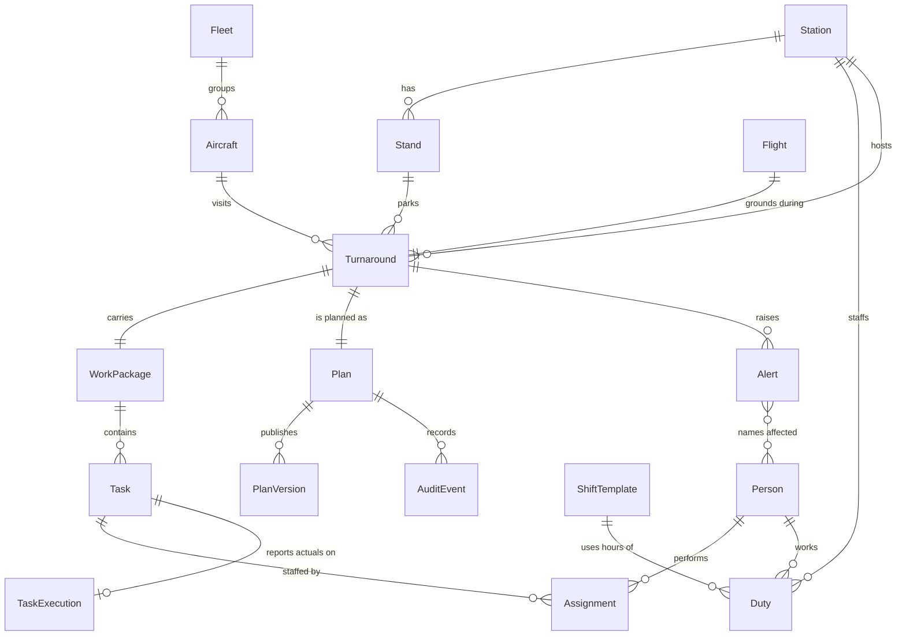
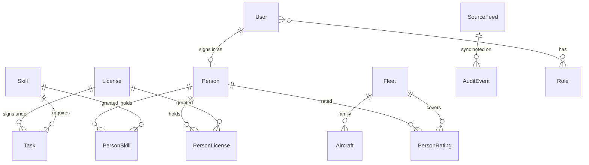

# Operational data model

This is the system of record for Assignment’s line-maintenance operation. It covers the objects the desktop app already plans against, and the alert, execution, and audit records the backend has to keep so later screens do not need a second migration.

The running UI still builds this operation in the browser from `src/data/mock.js`, `src/data/roster.js`, and `src/data/workpackages.js`, and keeps planner edits in `sessionStorage` under `assignment-plan-v1`. This document is the relational shape those objects map onto. Slicer choices stay in the browser (`assignment-slicers` and the URL). They are a view over the operation, not rows in it.

GitHub Pages serves the static build only. The schema and API live beside that build. The Pages demo keeps the in-browser generators until a hosted API is configured.

Product names and rules come from [PRD-Line-Maintenance-Assignment.md](../PRD-Line-Maintenance-Assignment.md) section 10 and from the planner and workforce code. Where the PRD lists a separate object and the mock flattens it onto the visit, the database keeps the separate object and the API joins it back into the visit the screens already render.

## Decisions

| Decision | Choice | Why |
| --- | --- | --- |
| Store | PostgreSQL | Visits, tasks, people, and assignments are relational, and publish, override, and rule changes need an append-only audit log. |
| Public ids | The string ids the app already uses | `/planner/:id`, task ids, and person ids are already stable in the mock and in session plans. |
| Working plan vs published plan | Live task and assignment rows are the draft. Each publish appends a snapshot. | That is how `plans[visitId].versions` works today. |
| Task time | Minutes from `turnaround.window_start`, plus duration | The Gantt and Generate already use `startMin`. A later change to the ground window keeps those offsets, and overrun is recomputed. |
| Conflicts | Computed on read and again on publish | Stored conflict rows go stale as soon as a bar moves. |
| Two hour measures | Visit estimates and assignment load stay separate | The dashboard Staff fill KPI sums visit `requiredHours` / `assignedHours`. The workforce board sums scheduled task minutes. |
| Visit health vs plan state | Two enums | Both use words like Draft and Published, and they live on different objects. |
| Person vs user | Two entities | A roster technician is not a login. A user may point at one person. |
| Shift template vs duty | Template is the Day / Evening / Night rule. Duty is one person on one shift. | The workforce editor edits the three templates. “On shift” in the mock is a flag; the backend records a duty so the same person can be off tomorrow. |

## Relationship overview

Reference data sits on the left. One turnaround ties a station, an aircraft, a flight, a stand, and one work package together. The plan, its tasks, and its assignments hang off that visit.



Skills, licenses, and type ratings are catalogs. People and tasks point at them through join rows. A task requires one skill and one license. A person may hold many of each, plus many fleet ratings.



## Relationship catalog

| From | To | Cardinality | Meaning |
| --- | --- | --- | --- |
| Station | Stand | 1 to many | Bays and stands belong to one station. |
| Station | Turnaround | 1 to many | The visit happens at one station. |
| Fleet | Aircraft | 1 to many | Rating and the fleet slicer use the family (`A320 family`), not the subtype (`A321`). |
| Aircraft | Turnaround | 1 to many | The same tail returns on later visits. |
| Flight | Turnaround | 1 to 1 | Line maintenance has one ground window per visit. The flight row holds the flight number and that window. |
| Stand | Turnaround | 1 to many | Optional. A visit with no resolved stand still stores the raw stand code. |
| Turnaround | Work package | 1 to 1 | One M&E package per visit in this model. |
| Work package | Task | 1 to many | Job cards. Ad-hoc tasks use the same table with `source = local`. |
| Turnaround | Plan | 1 to 1 | Plan state, publish policy, notes, and overrides. |
| Plan | Plan version | 1 to many | Append-only. The working copy is the live task and assignment rows. |
| Task | Assignment | 1 to many | The rules engine writes at most one person. The table allows a second person so an independent inspection does not need a new table. |
| Person | Assignment | 1 to many | Double-book checks compare these intervals across visits. |
| Person | Duty | 1 to many | Dated on-shift, off, or absent. |
| Shift template | Duty | 1 to many | Day 06:00–14:00, Evening 14:00–22:00, Night 22:00–06:00, with a B1 minimum. |
| Task | Task execution | 1 to 0..1 | Actuals. Empty until the floor reports a state. |
| Turnaround | Alert | 1 to many | Every current mock alert points at one visit. |
| Alert | Person | many to many | Sick call and absence name people. A delay alert may name nobody. |
| User | Person | 1 to 0..1 | Login is optional on a roster row. |
| User | Role | many to many | Admin, Planner, Supervisor, Technician, Viewer. |
| Plan, rule, or feed change | Audit event | 1 to many | Insert-only. |

Deleting a turnaround removes its work package, tasks, assignments, plan, versions, and execution rows. People, aircraft, stations, and catalogs remain. An alert whose visit is removed is removed with it. Audit events are not deleted.

## Entities

Types below are PostgreSQL types. `timestamptz` is UTC. Station-local display stays a UI concern, as it is today.

### Station

| Column | Type | Notes |
| --- | --- | --- |
| code | text, PK | `HEL`, `FRA`, `MUC`. |
| time_zone | text | `Europe/Helsinki` or `Europe/Berlin`. |
| name | text | Display name. Seed may repeat the code. |

### Stand

| Column | Type | Notes |
| --- | --- | --- |
| id | text, PK | `{station}-{code}`, for example `HEL-B14`. |
| station_code | text, FK | |
| code | text | What the visit shows, for example `B14`. Unique per station. |

### Fleet

| Column | Type | Notes |
| --- | --- | --- |
| id | text, PK | `A320 family`, `A330`, `B737`. Matches `FLEETS` in `src/slicers/model.js`. |

### Aircraft

| Column | Type | Notes |
| --- | --- | --- |
| registration | text, PK | Tail, for example `OH-LWP`. |
| type_code | text | Subtype: `A321`, `A20N`, `A333`, `B738`, `B38M`. |
| fleet_id | text, FK | Family used for ratings, Generate, and the fleet slicer. |
| operator | text | `AY` at HEL, `LH` at FRA and MUC. Taken from the flight prefix in the mock. |

### Flight

The mock stores the flight number and the ground window on the visit. They move here so a flight-ops update can change the window without rewriting task text.

| Column | Type | Notes |
| --- | --- | --- |
| id | text, PK | Same value as the turnaround id in the seed, prefixed `fl-` is unnecessary: use `flight:{turnaround_id}` only if a later visit reuses a flight. Seed uses `fl-{turnaround_id}`. |
| flight_number | text | `AY407`, `LH412`. |
| window_start | timestamptz | Current `windowStart`. Ground start, used as STA for the Gantt. |
| window_end | timestamptz | Current `windowEnd`. Release / STD bound. |
| estimated_start | timestamptz, null | Set when a delay feed moves the arrival. Null in the seed. |
| estimated_end | timestamptz, null | |

The effective ground window is `estimated_*` when set, otherwise `window_*`. Task offsets are minutes from the effective start. The seed leaves estimates null, so behavior matches the mock.

### Turnaround

One aircraft’s ground visit. This is the row behind `/planner/:id` and the attention table.

| Column | Type | Notes |
| --- | --- | --- |
| id | text, PK | `ta-hel-001`. |
| station_code | text, FK | |
| aircraft_registration | text, FK | |
| flight_id | text, FK, unique | |
| stand_id | text, FK, null | |
| shift_code | text | `Day`, `Evening`, or `Night`, from the effective start in the station time zone. Same rule as `shiftFor` in `mock.js`. Recompute when the window changes. |
| status | visit_status | Dashboard health. See enumerations. |
| blocked_reason | text, null | `parts`, `tools`, or `staff` when status is `Blocked`. Otherwise null. |
| required_hours | numeric(6,1) | Feed estimate. Dashboard Staff fill denominator. |
| assigned_hours | numeric(6,1) | Feed estimate. Dashboard Staff fill numerator. Independent of assignment rows. |

`staffFill` in the mock is `assigned_hours / required_hours`. The API computes that ratio. It does not store a third copy.

### Work package

| Column | Type | Notes |
| --- | --- | --- |
| id | text, PK | The mock `workOrder`, for example `WP-44013`. |
| turnaround_id | text, FK, unique | |
| source | text | `me` for the mock M&E feed. |
| source_key | text | Same as `id` until a real M&E key exists. |
| package_type | text | `transit` for the 12-card OH-LWP package, `line` for the 4-card package, `line-plus-repair` for D-AIGX’s structural repair. |

### Task

A job card on the working plan. Ordering is `sort_order`.

| Column | Type | Notes |
| --- | --- | --- |
| id | text, PK | `{turnaround_id}-t1`, or `{id}-split`, or `{turnaround_id}-adhoc-{n}`. |
| work_package_id | text, FK | |
| title | text | |
| sort_order | int | Current `order`. |
| duration_min | int | Estimate. Greater than 0. |
| skill_id | text, FK | `structures`, `engine`, `cabin`, `avionics`. |
| license_id | text, FK | `B1`, `A`, or `B2`. Current `cert`. |
| zone | text | `External`, `Engine`, `Cabin`, `Avionics`, `Gear`, `Cockpit`, `Fuselage`. |
| needs_parts | boolean | |
| needs_tools | boolean | |
| parts_ready | boolean | Default true when `needs_parts` is false. |
| tools_ready | boolean | |
| plan_status | task_plan_status | `pending`, `scheduled`, `deferred`, `na`. |
| start_min | int, null | Minutes from the effective ground start. Null until placed. |
| ad_hoc | boolean | |
| card_source | text | `AMP` or `local`. |
| notes | text | |

`critical` is computed. The chain is the assigned person whose last scheduled task ends at the makespan. See `markCritical` in `src/plan/engine.js`.

A task counts as scheduled when `plan_status` is not `deferred` or `na`, `start_min` is set, and it has at least one assignment. That is `isScheduled` in the engine.

### Assignment

| Column | Type | Notes |
| --- | --- | --- |
| id | text, PK | `{task_id}:{person_id}`. |
| task_id | text, FK | |
| person_id | text, FK | |
| | | Unique `(task_id, person_id)`. |

Planned start and end are derived: effective window start plus `start_min`, plus `duration_min`. The Gantt keeps using minutes.

### Plan

One row per turnaround.

| Column | Type | Notes |
| --- | --- | --- |
| turnaround_id | text, PK, FK | |
| state | plan_state | `Draft`, `Ready`, `Published`, `Locked`, `Completed`. |
| block_on_conflicts | boolean | Default true. |
| license_override | text | Written reason. Empty means a qualification break still blocks publish. |
| visit_notes | text | |
| last_generate_ok | boolean, null | |
| last_generate_reason | text | The sentence Generate shows today. |

Any edit to tasks or assignments on a plan that is past Draft returns the state to Draft and leaves published versions in place. That is `updateTasks` in `PlanContext.jsx`.

### Plan version

| Column | Type | Notes |
| --- | --- | --- |
| id | text, PK | `{turnaround_id}:v{n}` starting at `v1`. |
| turnaround_id | text, FK | |
| version_no | int | Unique per plan. |
| published_at | timestamptz | |
| snapshot | jsonb | The task rows and their assignments at publish. The diff view compares the last two snapshots, as `versionDiff` does. |

### Person

| Column | Type | Notes |
| --- | --- | --- |
| id | text, PK | `{STATION}-{Shift}-{index}`, for example `HEL-Evening-0`. |
| name | text | |
| home_station | text, FK | |
| team | text | `Line 1` or `Line 2`. A filter value, not its own table. |
| max_hours | numeric(4,1) | Default 8. |
| hours_already_worked | numeric(4,1) | Rest warning uses 8. This is a roster fact, not a sum of assignments. |

Ratings, licenses, and skills are join tables, not arrays.

| Table | Columns |
| --- | --- |
| person_rating | person_id, fleet_id. PK both. |
| person_license | person_id, license_id. PK both. |
| person_skill | person_id, skill_id. PK both. |

Catalogs `skill` and `license` are `(id text PK, name text)`.

A person qualifies for a task when all of the following hold. This is `personQualifies`:

- a duty for this visit’s station and shift code is `on shift` and covers the effective window
- `person_rating` includes the aircraft’s fleet
- `person_license` includes the task’s license
- `person_skill` includes the task’s skill

### Shift template

Global in the current product. The workforce editor changes these three rows for every station.

| Column | Type | Seed |
| --- | --- | --- |
| code | text, PK | `Day`, `Evening`, `Night` |
| start_local | time | 06:00, 14:00, 22:00 |
| end_local | time | 14:00, 22:00, 06:00 |
| coverage_license_id | text, FK | `B1` |
| minimum_count | int | 4, 3, 2 |

Coverage shortfall is computed: count of people with an `on shift` duty at that station and shift, compared with `minimum_count`.

### Duty

Replaces the mock’s single `availability` flag once the data is dated. The seed builds one duty per mock person covering the demo horizon (14 days back through 14 days ahead) so today’s board matches the roster file.

| Column | Type | Notes |
| --- | --- | --- |
| id | text, PK | `{person_id}:{starts_at}` |
| person_id | text, FK | |
| station_code | text, FK | |
| shift_code | text, FK | |
| availability | duty_availability | `on shift`, `off`, `absent`. |
| starts_at | timestamptz | |
| ends_at | timestamptz | Night crosses midnight. |

Unique `(person_id, starts_at)`.

### Task execution

Present so progress and time capture have a place. No screen writes it yet.

| Column | Type | Notes |
| --- | --- | --- |
| task_id | text, PK, FK | |
| execution_state | execution_state | `not_started`, `started`, `paused`, `blocked`, `done`. |
| blocked_reason | text, null | |
| actual_start | timestamptz, null | |
| actual_end | timestamptz, null | |
| actual_duration_min | int, null | Kept when the device recorded a duration and a clock time was missing. |

Planning status and execution state are different columns. Deferring a card does not mark it done on the floor.

### Alert

| Column | Type | Notes |
| --- | --- | --- |
| id | text, PK | `al-{turnaround_id}` in the seed. |
| turnaround_id | text, FK | |
| alert_type | alert_type | |
| severity | alert_severity | |
| state | alert_state | |
| created_at | timestamptz | |
| acknowledged_at | timestamptz, null | |
| resolved_at | timestamptz, null | |

`alert_person (alert_id, person_id)` names affected people. The seed leaves it empty: current alerts are visit-level.

Mock strings map as follows:

| Mock `type` | `alert_type` |
| --- | --- |
| `delayed flight` | `delayed_flight` |
| `ground-time risk` | `ground_time_shrink` |
| `missing parts` | `missing_part` |
| `missing tools` | `missing_tool` |
| `missing staff` | `absence` |

`unread: true` seeds `state = unread`. `unread: false` seeds `state = acknowledged`.

### Source feed

Three rows. The dashboard subtitle ages are `now - last_success_at`.

| code | Seed age |
| --- | --- |
| `me` | 12 seconds |
| `flight_ops` | 8 seconds |
| `hr` | 21 seconds |

Columns: `code text PK`, `last_success_at timestamptz`, `last_error text null`. A failed poll updates `last_error` and leaves `last_success_at` on the previous good sync. The working plan is left as it was.

### User, role, audit

These tables exist so admin and the audit requirement have a home. The seed inserts the five roles and no users. Sign-in is not part of the first API.

| Table | Columns |
| --- | --- |
| role | id text PK. Values: `admin`, `planner`, `supervisor`, `technician`, `viewer`. |
| app_user | id text PK, display_name, person_id FK null, unique. |
| user_role | user_id, role_id. PK both. |
| audit_event | id uuid PK, at timestamptz, actor_user_id null, action text, entity_type text, entity_id text, payload jsonb. |

Audit actions the plan service writes from the first write API: `plan.publish`, `plan.lock`, `plan.complete`, `plan.override`, `plan.generate`, `shift_template.update`. The app role receives insert on `audit_event` and no update or delete.

## Enumerations

```sql
create type visit_status as enum (
  'On track', 'In progress', 'Published', 'Draft', 'Completed',
  'At risk', 'Delayed', 'Blocked', 'Cancelled'
);

create type plan_state as enum (
  'Draft', 'Ready', 'Published', 'Locked', 'Completed'
);

create type task_plan_status as enum (
  'pending', 'scheduled', 'deferred', 'na'
);

create type execution_state as enum (
  'not_started', 'started', 'paused', 'blocked', 'done'
);

create type duty_availability as enum ('on shift', 'off', 'absent');

create type alert_type as enum (
  'delayed_flight', 'diverted_flight', 'cancelled_flight',
  'ground_time_shrink', 'absence', 'missing_part', 'missing_tool',
  'task_overrun', 'integration_failure'
);

create type alert_severity as enum ('low', 'medium', 'high');

create type alert_state as enum ('unread', 'acknowledged', 'resolved');
```

Visit status is the attention-list vocabulary, including `On track`, `In progress`, `Published`, `Draft`, `Completed`, and `Cancelled`. The status slicer offers only `At risk`, `Delayed`, `Blocked`, `In progress`, and `On track`. The column still stores the full set.

Seed severity: `high` when the visit is `Blocked` or `Delayed`, otherwise `medium`.

## Computed, not stored

| Value | Rule |
| --- | --- |
| Visit staff fill | `assigned_hours / required_hours` on the turnaround. Null when required hours are 0. This is the dashboard KPI. |
| Assignment load | Sum of `duration_min` over that person’s scheduled assignments in the slice, plus task count and bay changes. This is the workforce card. |
| Critical path | Person-chain that ends on the makespan. `markCritical`. |
| Constraint violation | Rows from `conflictsForVisit`: `overrun`, `qualification`, `shift`, `parts`, `tools`, `double-book`. Each is severity `P0`. Id pattern `{task_id}-over`, `-qual-{person}`, `-shift-{person}`, `-parts`, `-tools`, `-book-{person}`. |
| Publish block | P0 conflicts, except a `qualification` conflict is not blocking when `license_override` is non-empty, and no P0 conflict is blocking when `block_on_conflicts` is false. `blockingConflicts`. |
| Workforce warnings | Assigned hours above `max_hours` (overtime) and new work when `hours_already_worked` is already 8 (rest). These do not block publish. |
| Coverage | On-shift headcount versus `shift_template.minimum_count` for the selected station. |
| Double-booked people | Overlapping assignment intervals for one person, including across visits. |
| Slice membership | Effective window overlaps `[now, now + window)`, station, fleet, shift, and status. The same predicate as `buildSlice` in `src/data/slice.js`. Alerts enter the slice through their turnaround. |
| Prior-window KPI | Visits that overlap `[now - window, now)` and whose window has already ended. |

`now` for a request is an explicit timestamp. Tests pin it. The live API uses the server clock. The mock’s `now` is module load time; the seed script must accept the same timestamp it used to generate visits, or the 12-hour heroes will fall outside the window.

## Read shapes the API returns

The screens keep their current field names. The API assembles them.

**Visit list and dashboard.** One object per turnaround in the slice:

`id`, `tail`, `type`, `fleet`, `station`, `timeZone`, `flight`, `workOrder`, `stand`, `windowStart`, `windowEnd`, `status`, `blockedReason`, `shift`, `requiredHours`, `assignedHours`.

`tail` is the registration. `type` is `type_code`. `fleet` is `fleet_id`. `flight` is `flight_number`. `workOrder` is the work package id. Times are ISO-8601.

**Planner detail.** The visit, plus `tasks[]` with `id`, `visitId`, `title`, `durationMin`, `skill`, `cert`, `zone`, `needsParts`, `needsTools`, `partsReady`, `toolsReady`, `status`, `assignees`, `startMin`, `order`, `adHoc`, `source`, `critical`, `notes`. `assignees` is the assignment person ids. `critical` is filled by the server.

**Plan header.** `state`, `blockOnConflicts`, `licenseOverride`, `visitNotes`, `versions[{id, at, state}]`, `lastGenerateOk`, `lastGenerateReason`, and the conflict list.

**Workforce.** People with `ratings`, `licenses`, `skills`, and `availability` for the slice window, plus shift templates. Availability is the duty that covers `now` at the filtered station. Load is computed from assignments.

**Alerts count.** `{ unread, total }` for the slice. The inbox screen is later; the row is already complete enough to list.

## Write rules

The first write API is the set of mutations in `PlanContext`. The server reloads the visit, tasks, people, and duties and runs the same rules as `src/plan/engine.js` before it commits.

| Command | Effect |
| --- | --- |
| Generate | Replaces `start_min` and assignments on open tasks for that visit. Sets the plan to Draft and stores the reason. Does not publish. |
| Edit task, move, reorder, assign, split, defer, N/A, ad-hoc, notes | Updates live rows. Plan returns to Draft if it had moved on. |
| Mark ready | Allowed from Draft when the publish block is empty. |
| Publish | Allowed from Ready when the publish block is empty. Appends a plan version. Writes `plan.publish`. A qualification override writes `plan.override` with the reason. |
| Lock | Allowed from Published. |
| Complete | Allowed from Locked. |
| Update shift template | Updates the global row. Writes `shift_template.update`. |
| Auto-allocate / balance | Same task updates as Generate and reassignment, scoped to the visit ids in the slice. |

Publish with a remaining block returns 409 and does not insert a version. The client cannot turn that into a published row by skipping the check.

Generate stays a deterministic rules pass: one qualified on-shift person per open task, inside the ground window, refusing the draft when the longest card or the total cannot fit. The shared function is `generateSchedule`. Move that module to a package both the UI and the server import, so the two do not drift.

## Current object map

| Today | Table |
| --- | --- |
| `turnarounds[]` in `mock.js` | `station`, `aircraft`, `flight`, `stand`, `turnaround`, `work_package` |
| `alerts[]` | `alert` |
| `SYNC` | `source_feed` |
| `people` in `roster.js` | `person`, `person_rating`, `person_license`, `person_skill`, `duty` |
| `defaultShifts` | `shift_template` |
| `buildTasksByVisit()` | `task`, `assignment` |
| `emptyPlan()` and `plans` | `plan`, `plan_version` |
| `sessionStorage assignment-plan-v1` | the live rows above |
| `sessionStorage assignment-slicers` | not stored |
| Conflict list | response field, recomputed |
| `critical` | response field, recomputed |

Heroes the seed has to keep, because the planner demo depends on them:

- **OH-LWP**, next 12 hours, status `At risk`, visit fill 0.5, 12 transit cards, parts and tools ready.
- **D-AIGX**, next 12 hours, status `Delayed`, visit fill 0.78, plus a 360-minute structural repair with parts and tools not ready. Generate refuses it.
- **OH-LXK**, next 12 hours at HEL: the first two cards are 40 minutes, overlapping, both assigned to `HEL-{shift}-0`.
- B737 visits have no on-shift person rated for that fleet. The qualified mock technicians are rated `A320 family` and `A330` only. One off person and one absent person exist per station.
- About 168 turnarounds, three stations, from 14 days before the seed `now` to 14 days after. Seed `20260924` drives the random fill, not the ids’ usefulness.

## Implementation plan

Each step leaves the static UI working. The API is additive until step 5.

### 1. Schema

Add `server/db/migrations/001_operational.sql` with the tables, enums, foreign keys, and the audit insert-only grant in this document.

Done when a clean database migrates, the three shift templates and five roles insert, and a turnaround cannot be stored without a station, aircraft, and flight.

### 2. Seed

Add `server/db/seed.mjs`. It runs the existing generators with a pinned `now`, then inserts rows using the map above. Duties span the generator horizon. Alerts use the type map in this document.

Done when the seed counts match the generators: the three heroes exist, OH-LXK is double-booked, and a HEL / Now–12h slice taken at the pinned `now` returns the same turnaround ids as `buildSlice`.

### 3. Read API

Add a Node 22 process under `server/` with `pg`. Endpoints:

- `GET /api/slice?station&window&fleet&shift&status&now`
- `GET /api/turnarounds/:id`
- `GET /api/workforce?station&window&fleet&shift&now`
- `GET /api/feeds`

Query parameters use the same tokens as `src/slicers/model.js`. The JSON uses the read shapes above.

Done when those four calls reproduce the dashboard list, one planner detail, the workforce roster, and the three sync ages for a pinned `now`. The Vite app still reads its local modules.

### 4. Plan commands

Move `src/plan/engine.js` into a shared module imported by the UI and the server. Add the write commands from the table above. Publish and mark-ready recompute conflicts in the database transaction.

Done when publishing OH-LWP’s unscheduled package returns 409, publishing after a clean Generate and mark-ready appends `v1`, and a qualification break publishes only with a non-empty license override.

### 5. Client switch

`PlanContext` and `buildSlice` read and write the API when `VITE_API_BASE` is set. With the variable unset, the app keeps the generators and `sessionStorage`, which is what GitHub Pages builds.

Done when the dev server against the API completes the same planner path (Generate, conflict, publish, lock) and the workforce board shows the OH-LXK double-book, and `npm run build` without the variable still produces the static demo.

### 6. Later writes on tables that already exist

No new core tables for these. Add commands when the screen is built:

- alert acknowledge, resolve, and affected people
- task execution state and actuals
- users and roles
- a real M&E, flight-ops, or roster adapter writing into `flight`, `work_package`, `task`, `person`, and `duty`, and updating `source_feed`

Horizon and reports read these tables. They do not introduce a parallel store.

## Out of this model

- Slicer session and saved views
- Mobile offline queue (a client log of execution writes, replayed onto `task_execution`)
- Tool crib inventory beyond the task’s `tools_ready` flag
- AMP authoring, certificate release as the official technical log, and finance
